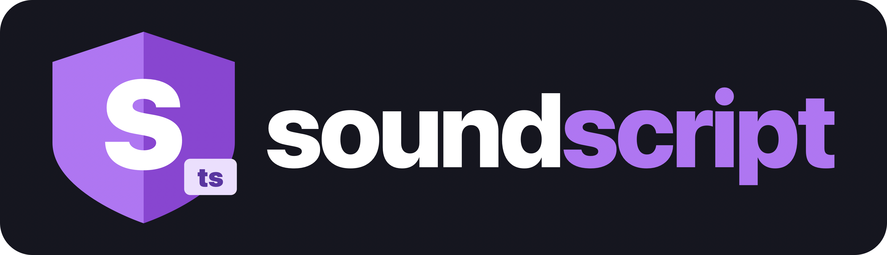

# soundscript

<p align="center">
  
</p>

soundscript is a sound checker and language tooling layer for TypeScript projects.

Prebuilt macOS, Linux, and Windows CLI downloads are attached to GitHub releases.

The intended stable v1 surface is the checker, mixed `.ts` / `.sts` adoption story, the VS Code
extension, a very small stdlib, and a narrow macro surface. Broader macro work and Wasm remain
experimental.

It adds a second file type, `.sts`, for code checked under a stricter rule set. Ordinary `.ts` files
keep normal TypeScript behavior. The goal is incremental adoption: move the parts of a codebase you
care about into `.sts`, keep the rest as `.ts`, and make interop explicit.

## Status

The release-facing v1 surface is:

- `.sts` for sound code
- mixed `.ts` / `.sts` projects
- `soundscript check`
- LSP support
- import-scoped macro authoring through the compiler-provided `sts:macros` builtin module
  - user-authored macro modules are `.macro.sts` compile-time plugin modules, not ordinary `.sts`,
    `.ts`, or `.js` scripts
- compiler-owned builtin modules under `sts:*`, with the stable v1 surface centered on
  `sts:prelude`, `sts:result`, `sts:match`, `sts:failures`, `sts:url`, `sts:fetch`, `sts:text`,
  `sts:random`, `sts:json`, `sts:compare`, `sts:hash`, `sts:decode`, `sts:encode`, `sts:codec`,
  `sts:derive`, `sts:async`, `sts:hkt`, `sts:typeclasses`, and `sts:macros`
- the canonical runtime/toolchain npm package `@soundscript/soundscript`, with emitted runtime and
  TS interop imports under `@soundscript/soundscript/*`

This repository also contains broader implemented experimental work beyond the stable v1 contract.
That includes the `soundscript compile` path, experimental builtin surfaces such as `sts:numerics`,
`sts:value`, and `sts:experimental/*`, `#[newtype]` and `#[value]`, proof and framework macros like
`#sql`, `#css`, `#graphql`, and `#component`, and the broader public Wasm target/runtime matrix
work. Those surfaces exist in the repo, but they are not the stable release-facing v1 contract.

## Quick start

Build the CLI:

```bash
deno task build
./bin/soundscript --help
```

Start a new project:

```bash
./bin/soundscript init
./bin/soundscript check
```

That creates `src/main.sts` and a `tsconfig.json` that includes both `src/**/*.ts` and
`src/**/*.sts`.

Add soundscript to an existing TypeScript project:

```bash
./bin/soundscript init --mode existing
./bin/soundscript check --project tsconfig.soundscript.json
```

That creates a `tsconfig.soundscript.json` overlay so you can start adding `.sts` files without
rewriting the rest of the project.

For CI or tooling:

```bash
./bin/soundscript check --project tsconfig.soundscript.json --format json
./bin/soundscript check --project tsconfig.soundscript.json --format ndjson
./bin/soundscript node src/main.sts
./bin/soundscript deno run src/main.sts
./bin/soundscript explain SOUND1002
```

`soundscript node` and `soundscript deno` expect `@soundscript/soundscript` to be installed in the
current project or an ancestor workspace, because the temporary transformed graph imports the
runtime package.

For published libraries, the intended package shape is:

- ordinary ESM `js + d.ts` for TypeScript and runtime consumers
- shipped authored `.sts` source under `package.json#soundscript.exports`
- `soundscript build` as the canonical package emit flow
- `soundscript node` and `soundscript deno` as local runtime wrappers for mixed `.ts/.sts` apps
- explicit adapter packages for local source-driven apps and bundlers: `@soundscript/register`,
  `@soundscript/bun-plugin`, `@soundscript/vite`, and `@soundscript/webpack-loader`
- source maps back to original `.sts` so stack traces and debuggers stay on authored source

The repository split is now:

- `soundscript` for the checker, CLI, LSP, runtime package, and generic project-transform support
  used by first-party adapters
- `website` for the public docs site and mirrored reference pages
- `adapters` for the explicit adapter packages and their host-specific implementations
- `editors` for editor clients such as the VS Code extension and `@soundscript/tsserver-plugin`

The public website and docs now live in the standalone website repository:
[soundscript-lang/website](https://github.com/soundscript-lang/website).

The leaf adapter packages are no longer vendored in this repo. Use the standalone adapters
repository: [soundscript-lang/adapters](https://github.com/soundscript-lang/adapters).

The editor packages are no longer vendored in this repo. Use the standalone editors repository:
[soundscript-lang/editors](https://github.com/soundscript-lang/editors).

For package emit:

```bash
./bin/soundscript build --project tsconfig.soundscript.json
```

The intended platform design is Deno-inspired:

- prefer Web-standard APIs first
- keep stdlib modules small and composable
- expose portable globals and leaf modules such as `fetch`, `URL`, and text encoding where the
  current runtime supports them
- keep host-specific behavior behind explicit wrappers instead of promising extra stable runtime
  modules

This package model is designed for external macro-authored libraries and frameworks. The soundscript
repo keeps only small generic fixture coverage for packaged macro resolution and runtime
materialization; framework implementations now live in their own repositories.

Exit codes are:

- `0` for success with no blocking diagnostics
- `1` for project diagnostics or unsupported-code findings
- `2` for CLI usage, project setup/configuration failures, or unexpected internal tool errors

## Release automation

The canonical release version comes from [src/cli.ts](src/cli.ts).

For a normal public release, bump `VERSION` there, push `main`, then run the
`Publish Release` GitHub Actions workflow. It will:

- run the release checks
- prepare and publish the npm package set
- create and push the `v<version>` tag
- create the GitHub release
- attach the platform CLI archives plus checksums

The workflow requires the `NPM_TOKEN` secret in the `soundscript` repo.

If you need to reattach CLI archives to an existing release, use the separate
`Backfill CLI Assets` workflow.

## What `.sts` means

`.sts` files are checked in soundscript.

`.ts` files are left alone.

When `.sts` code imports ordinary TypeScript, JavaScript, or declaration-only packages, the import
needs `// #[interop]`:

```ts
// #[interop]
import { readConfig } from './legacy.ts';
```

From the other direction, `.ts` can import `.sts` without any annotation. It sees a projected public
TypeScript surface for the `.sts` module.

That is the adoption model. Existing TypeScript stays where it is. New or critical code can move
into `.sts`.

## Remaining rough edges

soundscript removes a large set of TypeScript unsoundness paths, but it still lives inside JS/TS
runtime semantics. The main remaining rough edges are:

- `null` vs `undefined`, especially at JSON, regex, and trusted-interop boundaries
- arbitrary foreign throws and rejections; expansion-enabled source normalizes `catch (error)` and
  built-in Promise rejection handlers to plain `Error`, but other boundaries still require explicit
  normalization such as `sts:failures.normalizeThrown(...)`
- stable v1 still defaults to ordinary JS `number` behavior, including `NaN`, `Infinity`, and `-0`;
  the repo also contains experimental machine numerics work under `sts:numerics`, but that is
  outside the stable v1 contract
- stable v1 still relies heavily on structural typing for same-shape interface and object values;
  class nominality plus `#[newtype]` and `#[value]` exist in the repo, but the broader nominal and
  value-semantics story remains outside the stable v1 contract
- there is no active effort to remove raw `null` from the language; it remains part of the honest
  platform model

The release-facing contract for those boundaries is in
[docs/v1-user-contract.md](docs/v1-user-contract.md).

## Example

```ts
// src/math.sts
export function area(radius: number): number {
  return Math.PI * radius * radius;
}

const raw = JSON.parse('{"radius": 3}');

if (
  typeof raw === 'object' &&
  raw !== null &&
  'radius' in raw &&
  typeof raw.radius === 'number'
) {
  console.log(area(raw.radius));
}
```

There is no new syntax here. The difference is the checker.

## Commands

The main commands are:

- `soundscript init`
- `soundscript check`
- `soundscript build`
- `soundscript expand`
- `soundscript node`
- `soundscript deno`
- `soundscript explain`
- `soundscript lsp`

The repo also ships `soundscript compile`. `compile` and the broader compiler / Wasm surface remain
experimental; the checker is still the main entry point.

## Editor support

The language server runs over stdio:

```bash
soundscript lsp
```

There is also a VS Code client in the separate editors repo:

```bash
git clone https://github.com/soundscript-lang/editors.git ../editors
cd ../editors/packages/vscode
npm install
npm run compile
```

Then:

1. open the `editors` repo root in VS Code
2. run the `Run soundscript extension` launch configuration
3. in the spawned Extension Development Host, use `File -> Open Folder...` to open the workspace you
   want to test, for example `soundscript-example`
4. open an `.sts` file to confirm the `soundscript` language mode and TextMate grammar are active

Notes:

- the VS Code extension and `@soundscript/tsserver-plugin` live in
  [soundscript-lang/editors](https://github.com/soundscript-lang/editors)
- work from `../editors/packages/vscode` when developing the extension locally
- the extension prefers a workspace-installed `soundscript` binary and falls back to PATH unless you
  override `soundscript.server.command`
- `soundscript.server.*` settings only configure how the already-loaded extension launches the
  language server; those settings do not make VS Code discover the extension
- custom grammar-based syntax highlighting currently applies only to `.sts`; `.ts` and `.tsx` use
  the built-in TypeScript grammar and only pick up LSP features from soundscript

Current LSP support includes diagnostics, hover, signature help, definition, references, rename,
completions, document symbols, formatting, semantic tokens, and code actions / quick fixes.

## Repository layout

The repo also contains:

- checker and CLI
- `.ts` / `.sts` interop
- LSP
- macro work
- compiler / Wasm work

You do not need macros or Wasm to use soundscript as a checker.

## Development

The maintainer toolchain is Deno:

```bash
deno task build
deno task check
deno task fmt
deno task lint
deno task test
deno task verify
```

## Docs

Start here:

- [SPEC.md](SPEC.md)
- [ROADMAP.md](ROADMAP.md)
- [docs/README.md](docs/README.md)
- [docs/v1-user-contract.md](docs/v1-user-contract.md)
