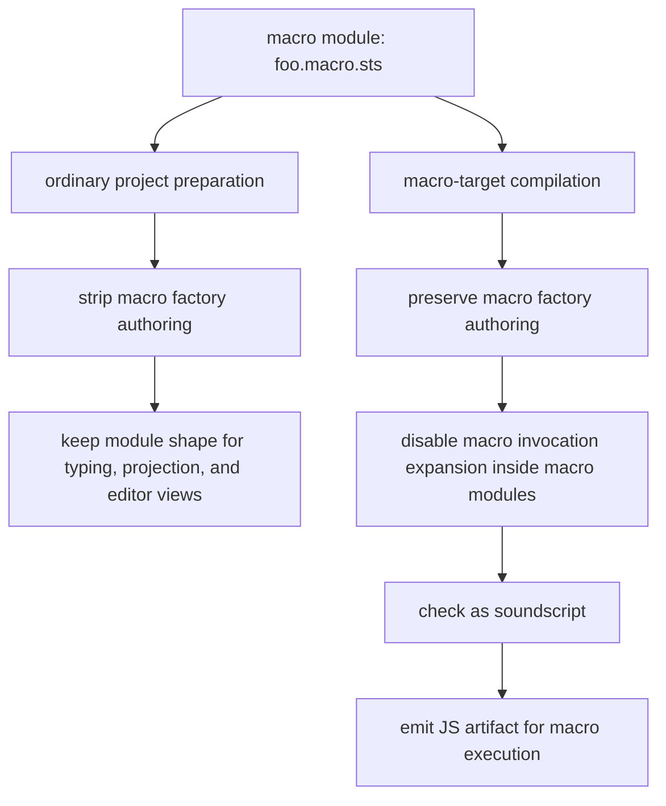
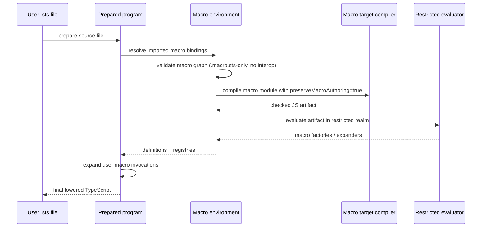

# Macro Execution Model

This note records the current macro execution model as implemented for v1 hardening.

It is the detailed reference companion to:

- [Macro Authoring](../macro-authoring.md)
- [soundscript V1 User Contract](../v1-user-contract.md)
- [SPEC](../../SPEC.md)

## Short Version

The current macro model is:

- user-authored macros are authored in `.macro.sts`
- macro modules compile through a dedicated compile-time macro target
- the execution artifact is host JavaScript as an implementation detail
- macro execution runs in a restricted compile-time environment
- the only supported host IO surface is `ctx.host`

The correct mental model is therefore:

> A soundscript macro is a `.macro.sts` compile-time plugin module compiled through a special
> macro target and evaluated in a restricted environment with explicit capabilities.

This is closer to Rust proc-macro crates than to ordinary Deno scripts or general TypeScript
plugins.

## Contract vs Current Enforcement

The public contract is:

- macro source language is soundscript
- macro graphs stay inside soundscript source
- macro results may depend only on:
  - the macro source graph
  - explicit `ctx.host` inputs
  - target/runtime metadata exposed on `ctx.runtime`

The current implementation enforces that contract by:

- compiling macro modules through the soundscript frontend/checker
- rejecting unsupported macro graphs before execution
- evaluating emitted JS in a restricted worker-backed realm
- denying unsupported ambient globals and nondeterministic APIs

The current evaluator runs through a restricted worker-backed sandbox. The worker does not get
ambient filesystem access. The current implementation still grants a small, fixed env allowlist
required by the TypeScript compiler bootstrap. A future subprocess sandbox may strengthen the
enforcement boundary further without changing the public API.

## Macro Source Graph Rules

User-authored macro modules:

- must be `.macro.sts`
- may depend on builtin `sts:*` modules
- may depend on other `.macro.sts` modules

Macro graphs may not cross:

- `#[interop]`
- projected `.d.ts` boundaries
- `.ts`, `.js`, `.mjs`, `.cjs`, `.tsx`, `.jsx`, or similar foreign source files

Macro authoring modules also may not recursively use macro syntax themselves in v1. Macro
invocations inside macro modules are rejected during macro-target compilation.

## Two Compilation Paths

The compiler treats macro modules differently depending on why it is preparing them.

### Ordinary Project Preparation

For normal project typing and projection:

- macro factory bodies are stripped
- module shape is preserved
- app/runtime typing remains fast and stable

### Macro-Target Compilation

For actual macro loading:

- authoring is preserved
- macro syntax expansion is disabled inside macro modules
- the module is checked through the soundscript frontend
- the module is emitted to a JS artifact

This split is why macro modules are real soundscript source without forcing ordinary project
preparation to execute or type every macro factory body as runtime code.

## End-to-End Expansion Pipeline

## Restricted Execution Environment

The supported compile-time host surface is only:

- `ctx.host.env.get`
- `ctx.host.env.require`
- `ctx.host.fs.readText`
- `ctx.host.fs.readBytes`
- `ctx.host.fs.exists`

Unsupported ambient globals and APIs include:

- `Deno`, `process`, `Bun`, `fetch`
- `console`
- timers
- `Date`, `performance`
- `Math.random`
- `crypto.randomUUID`, `crypto.getRandomValues`
- `eval`, `Function`
- dynamic `import()`

Top-level side effects that are rejected include:

- `#[interop]` anywhere in the macro graph
- top-level assignment or mutation
- class static blocks
- dynamic `import()`

`globalThis` mutation is also rejected in the restricted evaluator.

## Caching and Determinism

The compiler caches:

- macro scan results
- compiled macro artifacts keyed by dependency source text

The compiler does not persist live evaluated macro module instances across macro environments.

That means:

- changing a helper module invalidates the compiled artifact cache
- top-level mutable state does not leak across fresh macro environments
- the supported determinism model is based on source contents and explicit host inputs, not hidden
  retained runtime state

## Rust Comparison

Rust procedural macros are authored in Rust, compiled as a special crate type, and loaded by the
compiler during compilation. soundscript macros now follow the same overall shape:

- authored in the source language
- compiled as a special compile-time target
- executed by the compiler

The main difference is that soundscript deliberately narrows the supported capability surface much
more aggressively through `ctx.host` and ambient-runtime restrictions.

## What This Note Does Not Claim

This note does not claim that the current evaluator is a complete security sandbox. The current v1
implementation uses a restricted worker-backed evaluator with no ambient filesystem access and a
small fixed internal env allowlist for compiler bootstrap. The stable guarantee is the supported
macro contract, not OS-level isolation.
